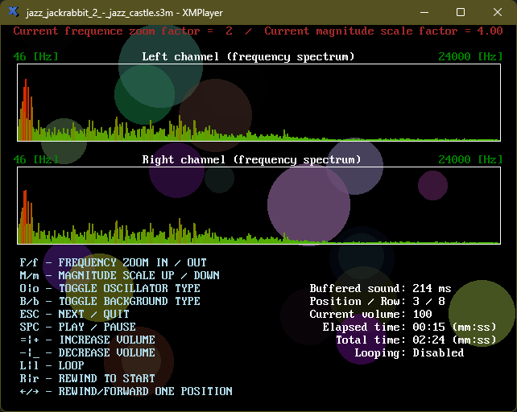

# What is this?

This is a [QB64-PE](https://github.com/QB64-Phoenix-Edition/QB64pe) compatible simplified library based on [Libxmp](https://github.com/libxmp/libxmp). [Libxmp](https://github.com/libxmp/libxmp) is a library that renders [module files](https://en.wikipedia.org/wiki/Module_file) to PCM data. It supports over 90 mainstream and obscure module formats including [Protracker (MOD)](https://en.wikipedia.org/wiki/MOD_(file_format)), [Scream Tracker 3 (S3M)](https://en.wikipedia.org/wiki/S3M_(file_format)), [Fast Tracker II (XM)](https://en.wikipedia.org/wiki/XM_(file_format)), and [Impulse Tracker (IT)](https://en.wikipedia.org/wiki/Impulse_Tracker#IT_file_format).

This is also loosely based on a [similar library](https://qb64phoenix.com/forum/showthread.php?tid=29) by [RhoSigma](https://github.com/RhoSigma-QB64).




## Features

- Easy plug-&-play API optimized for demos & games
- Works with the 64-bit QB64 complier (unlike RhoSigma's library that is 32-bit only)
- Libxmp is statically linked to the complied executable (no DLL dependency)
- Demo player that shows how to use the library

## API

```VB
Function XMPLoadFile%% (sFileName As String)
Sub XMPStartPlayer
Sub XMPUpdatePlayer
Sub XMPStopPlayer
Function XMPGetVolume%
Sub XMPSetVolume (nVolume As Integer)
```

## Important note

- Due to a bug in some versions of QB64 (v2.0.2 and lower) and QB64-PE (v0.8.2 and lower), it fails to link static libraries on Windows. This has been fixed in [QB64-PE v3.0.0+](https://github.com/QB64-Phoenix-Edition/QB64pe/releases/). See [issue # 122](https://github.com/QB64-Phoenix-Edition/QB64pe/issues/112) and this [Discord thread](https://discord.com/channels/975381912350752819/975383819848912926/985214420487655454).

- IT, XM, S3M & MOD support is built into [QB64-PE v3.1.0+](https://github.com/QB64-Phoenix-Edition/QB64pe/releases/). The [miniaudio](https://miniaud.io/) backend in this version of OB64-PE uses [Libxmp-lite](https://github.com/libxmp/libxmp/tree/master/lite). So, this is not required with versions of [QB64-PE](https://github.com/QB64-Phoenix-Edition/QB64pe/releases/) >= v3.1.0 with the default miniaudio backend selected. Use this only with QB64 and QB64-PE with OpenAL backend.
