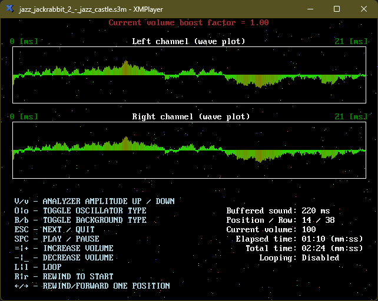

# LIBXMP-64

This is a [QB64-PE](https://github.com/QB64-Phoenix-Edition/QB64pe) compatible minimalistic & simplified library based on [Libxmp](https://github.com/libxmp/libxmp). [Libxmp](https://github.com/libxmp/libxmp) is a library that renders [module files](https://en.wikipedia.org/wiki/Module_file) to PCM data. It supports over 90 mainstream and obscure module formats including [Protracker (MOD)](https://en.wikipedia.org/wiki/MOD_(file_format)), [Scream Tracker 3 (S3M)](https://en.wikipedia.org/wiki/S3M_(file_format)), [Fast Tracker II (XM)](https://en.wikipedia.org/wiki/XM_(file_format)), and [Impulse Tracker (IT)](https://en.wikipedia.org/wiki/Impulse_Tracker#IT_file_format).

This is also loosely based on a [similar library](https://qb64phoenix.com/forum/showthread.php?tid=29) by [RhoSigma](https://github.com/RhoSigma-QB64).




## FEATURES

- Easy plug-&-play API optimized for demos & games
- Works with the 64-bit QB64 complier (unlike RhoSigma's library that is 32-bit only)
- Works on Windows (64-bit) and Linux (64-bit)
- Demo player that shows how to use the library

## API

```VB
FUNCTION XMP_LoadTuneFromFile%% (fileName AS STRING)
FUNCTION XMP_LoadTuneFromMemory%% (buffer AS STRING)
FUNCTION XMP_GetTuneName$
FUNCTION XMP_GetTuneType$
SUB XMP_Play
SUB XMP_Stop
SUB XMP_Replay
FUNCTION XMP_IsPlaying%%
SUB XMP_Pause (state AS _BYTE)
FUNCTION XMP_IsPaused%%
SUB XMP_Loop (state AS _BYTE)
FUNCTION XMP_IsLooping%%
SUB XMP_GoToNextPosition
SUB XMP_GoToPreviousPosition
SUB XMP_SetPosition (position AS LONG)
SUB XMP_SeekToTime (timeMs AS LONG)
SUB XMP_SetVolume (volume AS LONG)
FUNCTION XMP_GetVolume&
SUB XMP_Update (bufferTimeSecs AS SINGLE)
```

## NOTES

- This requires the latest version of [QB64-PE](https://github.com/QB64-Phoenix-Edition/QB64pe/releases/latest)
- IT, XM, S3M & MOD support is built into [QB64-PE](https://github.com/QB64-Phoenix-Edition/QB64pe/releases/latest). The [miniaudio](https://miniaud.io/) backend in OB64-PE uses [Libxmp-lite](https://github.com/libxmp/libxmp/tree/master/lite). So, this is not technically not required
- However, Libxmp-lite in QB64-PE does not support any other format other than IT, XM, S3M & MOD. Use this if you need to play those rare and obscure module formats
- Help is needed to build macOS 64-bit shared library from the latest Libxmp sources. Let me know if you can build and contribute
